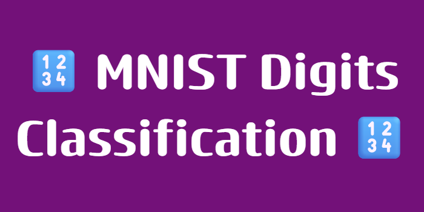
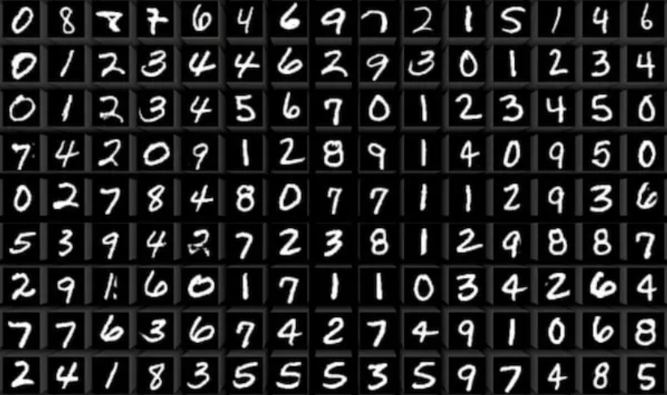
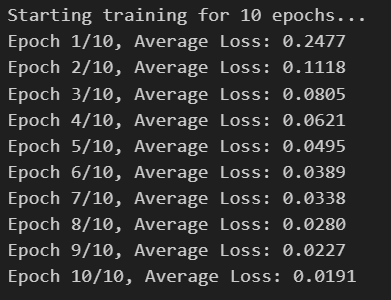
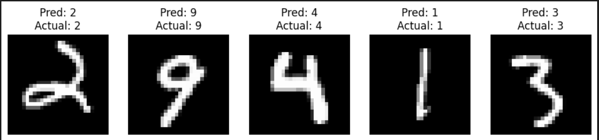

# MNIST Digits Classification 🔢
🖋️ Handwritten digit classification using a Neural Network built from scratch with NumPy, featuring manual backpropagation and MNIST data processing

## Table of Contents  

1. [About](#about)  
2. [Features](#features)  
3. [Requirements](#requirements)  
4. [Installation](#installation)  
5. [Usage](#usage)  

---

## About

The **MNIST Digit Classifier** is a custom-built machine learning project designed to recognize and classify handwritten digits (0-9). 

The project utilizes the **MNIST dataset**, a benchmark in the computer vision world containing 70,000 grayscale images of handwritten digits. Built entirely from scratch using **NumPy**, this project serves as a deep dive into the internal mechanics of neural networks. It demonstrates how a **Multi-Layer Perceptron (MLP)** can be implemented without high-level frameworks, achieving high accuracy through manual mathematical derivation and optimization.


---
## Features

- **From-Scratch MLP Implementation**: A fully connected Neural Network built entirely with NumPy, featuring a custom architecture (784 inputs, 128 hidden neurons, 10 outputs).
- **Manual Backpropagation**: Full implementation of the chain rule to compute gradients and update weights/biases without external DL frameworks.
- **Dual Activation Functions**: Utilization of the **Sigmoid** function for hidden layer non-linearity and **Softmax** for multi-class probability distribution.
- **Advanced Loss Calculation**: Integration of **Negative Log Likelihood (NLL)** loss to measure model performance accurately.
- **Robust Data Preprocessing**: Custom **Min-Max Scaling** and data reshaping to handle the 70,000 MNIST samples efficiently.
- **High Accuracy Performance**: Reaches a benchmark of **97.25% accuracy** on the test set within 10 epochs.
- **Visual Validation**: Includes a visualization tool to display random test images alongside the model's predicted labels.


---
## Requirements

- **Python 3.x**: The core programming language used for the project.  
- **Jupyter Notebook environment**: VS Code (with Jupyter extension), JupyterLab, or Google Colab to run the `.ipynb` file.  
- **NumPy**: For efficient numerical computations and matrix operations.  
- **Scikit-Learn**: Specifically used for fetching the MNIST dataset and splitting the data.
- **Matplotlib**: For generating graphs and visualizing the non-linear decision boundaries.  
- **Git**: To clone the repository.


---
## Installation

### 1. Clone the repository
```bash
git clone https://github.com/Amit-Bruhim/MNIST-Digits-Classification.git
```

### 2. Navigate into the project folder
```bash
cd MNIST-Digits-Classification
```

### 3. Install required libraries
```bash
pip install numpy scikit-learn matplotlib
```

### 4. Open and Run the Notebook
Open the file `src/digits_classification.ipynb` using VS Code or upload it to Google Colab.  

You can then click **"Run All"** to execute the training and see the results.

*Tip: You don't have to run the code to see the results; you can simply scroll through the notebook to view the pre-saved outputs and graphs.*


---
## Usage

### 1. Data Exploration
The project begins with loading the MNIST dataset. We visualize the raw grayscale images to understand the input data before it's flattened and normalized for the neural network.


### 2. Training Process
During training, the model iterates through the dataset and updates its weights. You can observe the training progress through the decreasing loss values printed in the console, indicating that the model is converging.  


### 3. Model Evaluation
After the training phase, we evaluate the model's accuracy on the test set. The implementation consistently achieves high performance, demonstrating the effectiveness of the manual backpropagation.
> **Final Result:** Our model reaches a benchmark of **97.25% accuracy**.

### 4. Visualizing Predictions 🔢
To verify the model in action, we select 5 random samples from the test set. The visualization shows the handwritten digit alongside the model's prediction, highlighting its ability to generalize to new data.

